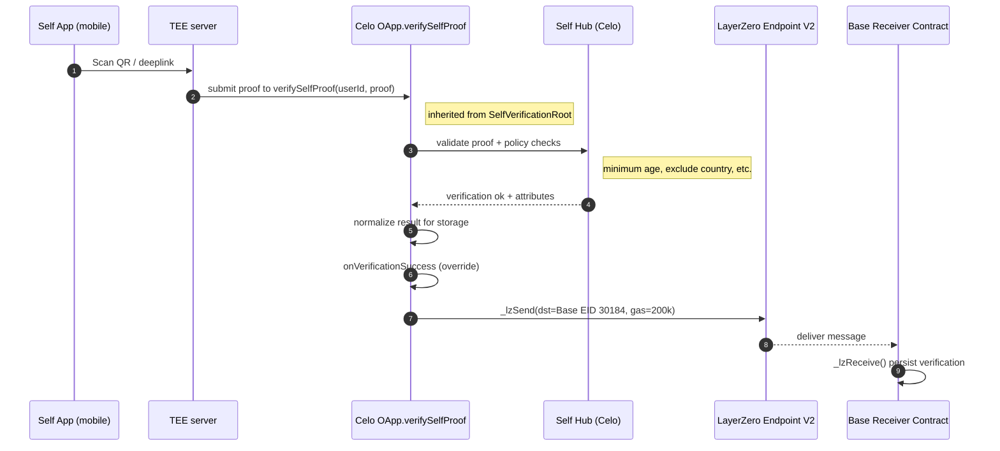

# Self Protocol + LayerZero (Celo → Base)

Build a cross-chain verification flow with Self Protocol on Celo Mainnet and forward results to Base Mainnet via LayerZero.

## 📁 Project Structure
```
self-layerzero-example/
├── app/                      # Frontend (Next.js)
│   └── app/
│       ├── page.tsx          # QR + Connect Wallet (no manual address input)
│       └── status/page.tsx   # Recent sends/receipts (polling)
└── contracts/                # Contracts + scripts (Foundry)
    ├── src/
    │   ├── ProofOfHumanOApp.sol      # Celo sender (Self + LZ OApp, has withdraw())
    │   └── ProofOfHumanReceiver.sol  # Base receiver
    ├── script/
    │   └── deploy-oapp-cross-chain.sh
    ├── Makefile              # make deploy, set-scope, fund-source, withdraw-source...
    └── .env(.example)
```

## ✅ Prerequisites
- Node.js 20
- Foundry toolchain
- Self App (iOS/Android)
- Wallet funded on Celo (deploy + funding) and Base (deploy)
- Note: Celo Alfajores is not supported by LZ v2

## 🚀 Quick Start

```bash
# 1) Install
cd contracts && npm install && forge install
cd ../app && npm install

# 2) Configure contracts/.env (edit PRIVATE_KEY, VERIFICATION_CONFIG_ID, SCOPE_SEED)
cd ../contracts && cp .env.example .env

# 3) Deploy (deploys + verifies + sets scope/peers + writes app/.env)
make deploy

# 4) Fund source (required for auto-forward; recommend ≥ 0.5 CELO)
make fund-source AMOUNT=0.5

# 5) Run frontend
cd ../app && npm run dev   # http://localhost:3000
```

On the homepage:
- Connect Wallet → scan QR with Self App → auto navigate to `/status` for delivery logs

## 🧠 How It Works
- Verification is initiated from the Self mobile app and executed inside a TEE server (trusted execution environment) that submits the proof to your on‑chain endpoint on Celo.
- Your endpoint is the OApp’s `verifySelfProof` (inherited from `SelfVerificationRoot`). It calls the Self Hub on Celo to validate the proof and your policy (e.g., minimum age, exclude country) and normalizes the result for retrieval.
- After success, your overridden `onVerificationSuccess` hook runs and calls `_lzSend` with a minimal payload. LayerZero V2 delivers it to Base (EID 30184), where the receiver persists the verification.



##

## 💡 Best Practices
- Keep cross-chain payload minimal (e.g., `userAddress`, `verificationConfigId`, small `timestamp/flag`)
- Avoid large strings/arrays; fees grow with bytes + dst gas
- Fund before testing; insufficient funds will skip sends silently

## 🔗 Network
- Celo Mainnet (EID 30125)
  - RPC: https://forno.celo.org, Explorer: https://celoscan.io
- Base Mainnet (EID 30184)
  - RPC: https://mainnet.base.org, Explorer: https://basescan.org

## 📚 References
- Self Docs: https://docs.self.xyz
- Self Tools: https://tools.self.xyz
- LayerZero OApp: https://docs.layerzero.network
